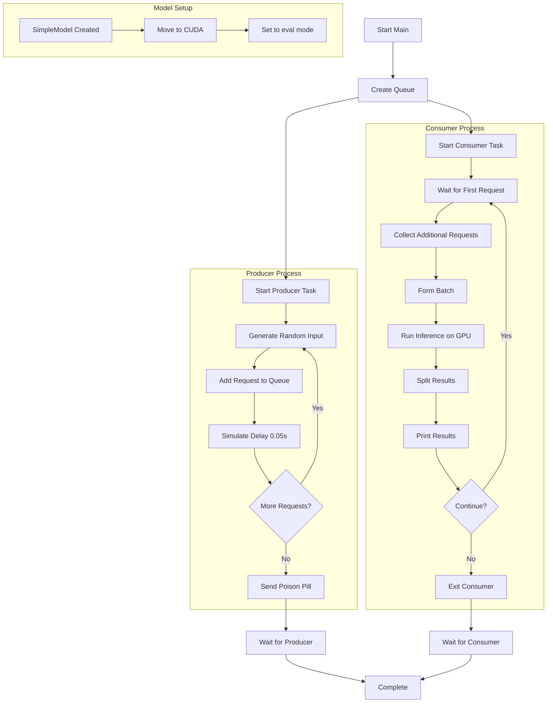
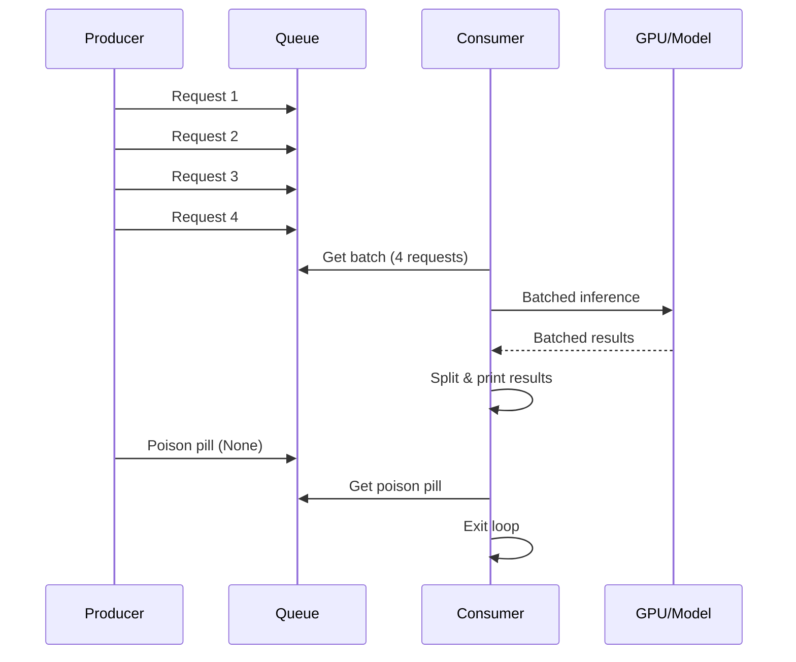

# Inference Pipeline Documentation

This document explains the asynchronous batching inference pipeline implemented in `inference.py`.

## Overview

The system implements an efficient batching mechanism for PyTorch model inference using asyncio. It collects multiple inference requests into batches to maximize GPU utilization and throughput.

## Architecture Flow



## Component Details

### 1. Model (`SimpleModel`)
- **Architecture**: Single linear layer (4 → 2 features)
- **Location**: GPU (CUDA)
- **Mode**: Evaluation mode for consistent inference
- **Formula**: `y = xW^T + b`

### 2. Producer
- **Role**: Generates inference requests
- **Rate**: ~20 requests/second (0.05s delay)
- **Data**: Random tensors of shape (1, 4)
- **Termination**: Sends poison pill (None) when done

### 3. Batching Consumer
- **Batch Size**: Up to 4 requests
- **Timeout**: 0.2 seconds for batch collection
- **Strategy**: 
  - Wait for at least one request
  - Collect additional requests without blocking
  - Process batch when full or timeout reached

### 4. Inference Pipeline


## Key Benefits

1. **Batching Efficiency**: Processes multiple requests simultaneously
2. **GPU Utilization**: Maximizes parallel computation on GPU
3. **Asynchronous Processing**: Non-blocking request handling
4. **Memory Optimization**: Uses `torch.no_grad()` to save memory
5. **Graceful Shutdown**: Poison pill pattern for clean termination

## Performance Considerations

- **Batch Size**: Configurable (default: 4) - balance between latency and throughput
- **Timeout**: Prevents indefinite waiting for incomplete batches
- **GPU Memory**: Data moved to/from GPU efficiently
- **Thread Safety**: Uses `asyncio.to_thread()` for CPU-bound inference

## Usage

```bash
python src/inference.py
```

The system will:
1. Generate 10 random inference requests
2. Batch them efficiently (groups of up to 4)
3. Process each batch on GPU
4. Display results for each request
5. Terminate gracefully
